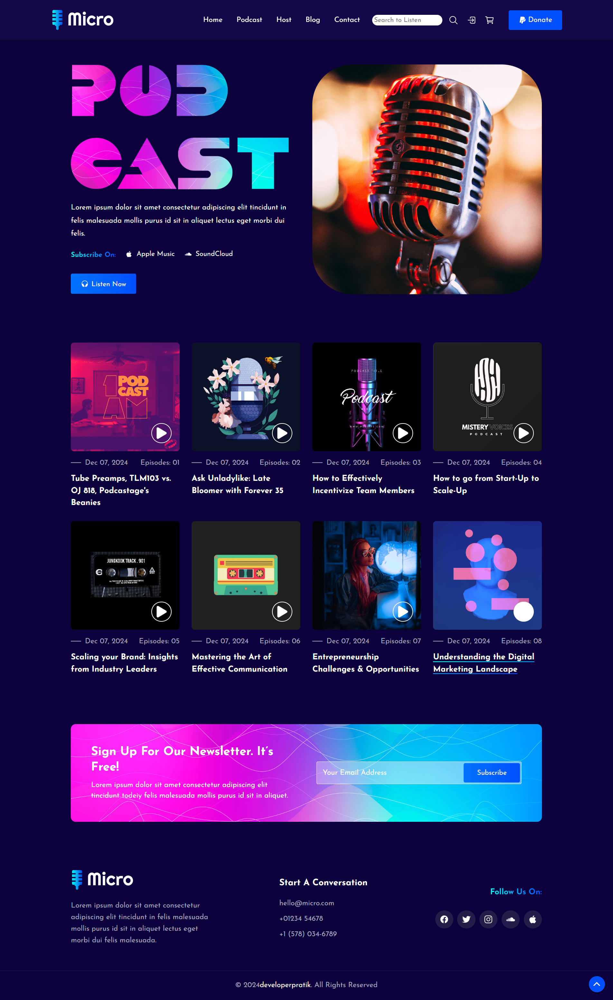

# 🎙️ Micro - Podcast Website

Welcome to **Micro**, a sleek, modern podcast website interface where users can browse and play various podcast episodes with a single click. Designed for simplicity and engagement, it features a responsive layout, smooth user experience, and custom audio player functionality.

## 🚀 Features

- 🎧 Custom audio player with play/pause toggle
- 🔍 Integrated search bar
- 🧭 Responsive navigation and sticky header
- 📩 Newsletter subscription with validation
- 🖼️ Clean, aesthetic UI powered by modern CSS
- 📱 Fully responsive layout for all devices

## 🛠️ Built With

- HTML5
- CSS3 (Custom properties & responsive design)
- JavaScript (DOM manipulation, event handling)

